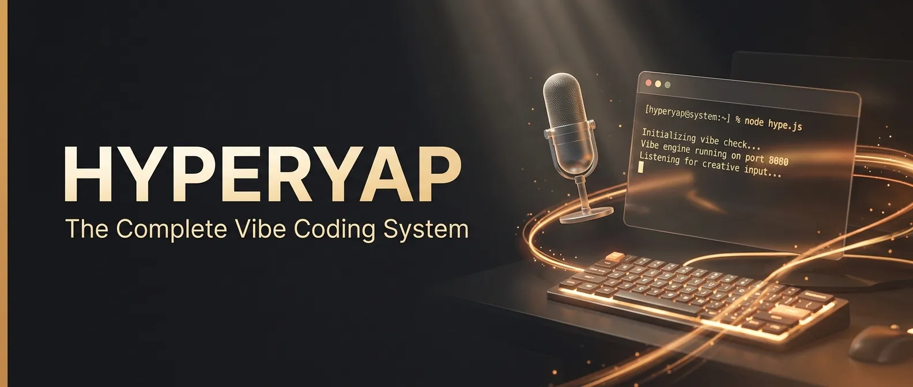

<p align="center">
  
</p>

# HyperYap - Local Voice-to-Text for Windows

[](https://github.com/avalonreset/hyperyap/actions/workflows/ci.yaml)
[](https://github.com/avalonreset/hyperyap/releases)
[](LICENSE)
[](https://github.com/avalonreset/hyperyap/commits/main)

HyperYap is a local voice-to-text application that bundles speech recognition, a terminal emulator, and hotkey automation into a single zero-config installer for Windows. No cloud, no internet required for transcription, no data collection. Install once, use everywhere.

## Table of Contents

- [What You Get](#what-you-get)
- [One-Line Install](#one-line-install)
- [Default Hotkeys](#default-hotkeys)
- [Requirements](#requirements)
- [How It Works](#how-it-works)
- [Configuration](#configuration)
- [Build from Source](#build-from-source)
- [Contributing](#contributing)
- [Attribution](#attribution)
- [License](#license)

## What You Get

HyperYap bundles three tools into a single grab-and-go package:

| Component | What It Does |
|-----------|-------------|
| **HyperYap voice engine** | Local speech-to-text powered by NVIDIA [Parakeet TDT 0.6B v3](https://huggingface.co/nvidia/parakeet-tdt-0.6b-v3) |
| **[BenjaminTerm](https://github.com/avalonreset/BenjaminTerm)** | Hacker-styled WezTerm terminal with smart clipboard, 86 dark themes, and borderless mode |
| **Hotkey scripts** | Mouse side buttons to F13 (record), CapsLock to F13, Mouse Forward to Enter |
| **Smart paste** | Ctrl+V in BenjaminTerm auto-saves clipboard images as PNGs |
| **Auto-boot** | Everything starts on login. No setup after reboot. |
| **Preset configs** | Toggle-to-talk, English, overlay on bottom, all shortcuts pre-mapped |

## One-Line Install

```powershell
irm https://raw.githubusercontent.com/avalonreset/hyperyap/main/install.ps1 | iex
```

Or clone and run locally:

```powershell
git clone https://github.com/avalonreset/hyperyap.git
cd hyperyap
powershell -ExecutionPolicy Bypass -File install.ps1
```

The installer downloads the NVIDIA Parakeet speech model (~440MB), installs AutoHotkey v2 and BenjaminTerm if not present, deploys preset configs, and sets everything to auto-start on boot.

## Default Hotkeys

| Key | Action |
|-----|--------|
| `F13` / `CapsLock` / Mouse Back | Start/stop recording |
| Mouse Forward | Enter |
| `Ctrl+Shift+Space` | Paste last transcript |
| `Ctrl+Alt+Space` | LLM-assisted recording |
| `Ctrl+Shift+X` | Command mode |
| `Escape` | Cancel recording |

## Requirements

- **Windows 10+** (Windows only)
- A microphone
- ~700MB disk space (voice model)

AutoHotkey v2 and BenjaminTerm are installed automatically if not present.

## How It Works

1. Press the hotkey (F13, CapsLock, or Mouse Back) to start recording
2. Speak naturally into your microphone
3. Press the hotkey again to stop recording
4. HyperYap transcribes locally using the Parakeet TDT model
5. The transcription is automatically pasted into the active window

All processing happens on your machine. Audio never leaves your computer.

## Configuration

HyperYap works out of the box with zero configuration. All settings can be changed from the app's Settings page.

| Setting | Default | Description |
|---------|---------|-------------|
| Record mode | Toggle-to-talk | Press once to start, press again to stop. Can be changed to push-to-talk. |
| Record shortcut | F13 | Configurable to any key or key combination |
| Language | English | Supports multiple languages via the Parakeet model |
| Overlay | Bottom of screen | Recording indicator position. Can be set to top, bottom, or hidden. |
| LLM Connect | Disabled | Post-process transcriptions with a local LLM (Ollama) or remote API |
| HTTP API | Disabled | Local API on localhost for external tool integration |
| Sound feedback | Enabled | Audio cues when recording starts and stops |
| Copy to clipboard | Disabled | Optionally keep transcriptions in the clipboard |

Settings are stored in `%APPDATA%/com.avalonreset.hyperyap/settings.json`. The installer deploys sensible defaults so you never need to touch this file manually.

### Hotkey Customization

All hotkeys can be remapped from the Settings page. The bundled AutoHotkey script (`hyperyap-hotkeys.ahk`) handles mouse button and CapsLock remapping separately. To customize those mappings, edit the script at `%LOCALAPPDATA%/HyperYap/scripts/hyperyap-hotkeys.ahk`.

## Build from Source

```bash
pnpm install
pnpm tauri dev      # development
pnpm tauri build    # production build
```

Requires: Node.js 18+, Rust, pnpm, [Tauri prerequisites](https://v2.tauri.app/start/prerequisites/)

Download the [Parakeet model](https://github.com/Kieirra/murmure-model/releases/download/1.0.0/parakeet-tdt-0.6b-v3-int8.zip) and extract to `resources/parakeet-tdt-0.6b-v3-int8/`.

## Contributing

Contributions are welcome. See [CONTRIBUTING.md](CONTRIBUTING.md) for development setup, PR workflow, and coding guidelines.

Please read the [Code of Conduct](CODE_OF_CONDUCT.md) before contributing.

## Attribution

HyperYap's voice engine is a modified version of [MURmure](https://github.com/Kieirra/murmure) by [Kieirra](https://github.com/Kieirra). Full credit to the original author for building an excellent local speech-to-text application.

[BenjaminTerm](https://github.com/avalonreset/BenjaminTerm) is a custom distribution of [WezTerm](https://github.com/wezterm/wezterm) by Wez Furlong.

Powered by NVIDIA's [Parakeet TDT 0.6B v3](https://huggingface.co/nvidia/parakeet-tdt-0.6b-v3) speech recognition model.

## License

The voice engine is licensed under [AGPL-3.0](LICENSE). BenjaminTerm is licensed under MIT. See [NOTICE](NOTICE) for full attribution details.
